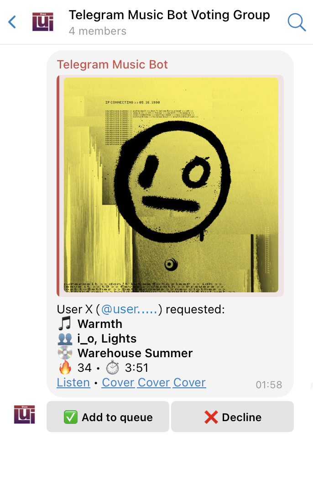

# Telegram Music Bot 🎵

A Telegram bot for crowd-curated music queues at **parties, bars, or events** — without giving guests direct access to your Spotify account.

Users send Spotify track links to the bot, and song requests are forwarded to a **voting chat**, where designated users can **approve or decline** each track. Approved tracks are automatically added to your **Spotify playback queue**.

---

## ✨ Features

- 📩 Accepts **Spotify track URLs** (full or short links)
- 🔄 Forwards requests to a **voting chat** (group or private)
- ✅ Vote to **Add to Queue** or ❌ Decline
- 🔐 No direct access to Spotify required for requesters
- 🎶 Perfect for **bars, parties, and shared listening sessions**

  


---

## 🚀 Setup

### 1. Clone the repository

```bash
git clone https://github.com/daslui/telegram-music-bot.git
cd telegram-music-bot
````

### 2. Configure environment

Copy the sample `.env` file and fill in your credentials:

```bash
cp .env.sample .env
```

| Variable                    | Description                                                                                        |
| --------------------------- | -------------------------------------------------------------------------------------------------- |
| `TELOXIDE_TOKEN`            | Telegram bot token from **@BotFather**                                                             |
| `RSPOTIFY_CLIENT_ID`        | Spotify API Client ID (create at [https://developer.spotify.com/](https://developer.spotify.com/)) |
| `RSPOTIFY_CLIENT_SECRET`    | Spotify Client Secret                                                                              |
| `TELEGRAM_VOTING_CHAT_ID`   | Chat ID of the voting chat (`/id` command can help discover it)                                    |
| `TELEGRAM_VOTING_THREAD_ID` | *(Optional)* Thread/topic ID if using topic-based group chats                                      |
| `RSPOTIFY_CACHE_PATH`       | *(Optional)* Custom path for Spotify credential cache                                              |

### 3. Run the bot

#### Option A: With Cargo

```bash
cargo run
```

#### Option B: With Docker Compose

```bash
docker compose up -d
```

---

## ✅ Telegram Group Requirements

If your **voting chat is a Telegram group**, make sure to:

1. **Add the bot as a member of the group**
2. **Allow the bot to read messages** — it needs this to process `/spotifylogin` and voting responses

> 📌 *If the voting chat is a **private chat with a Telegram user**, no special permissions are required.*

---

## 🔑 Spotify Authentication

From the **voting chat**, send:

```text
/spotifylogin
```

This starts the login flow. After authenticating, Spotify will redirect you to a URL like:

```text
http://localhost:8888/callback?code=...
```

It will likely show an error in the browser — **this is expected**. Just **copy the full URL** and **paste it into the Telegram chat**. The bot will store the session.

If the bot loses access in the future, repeat the `/spotifylogin` process.

---

## 🧪 Usage Flow

| Step | Action                                             |
| ---- | -------------------------------------------------- |
|  1️⃣  | User sends a **Spotify link** to the bot           |
|  2️⃣  | Bot forwards the request to the **voting chat**    |
|  3️⃣  | Members approve ✅ or decline ❌                     |
|  4️⃣  | Approved tracks are **added to the Spotify queue** |

---

## 🛠️ Development

Contributions welcome! Ideas and pull requests are appreciated.

---

## 📄 License

MIT (see [LICENSE](./LICENSE))

---

Happy queueing! 🎧
